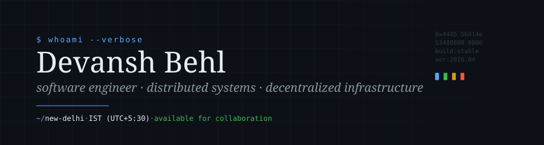

<!--
  ━━━━━━━━━━━━━━━━━━━━━━━━━━━━━━━━━━━━━━━━━━━━━━━━━━━━━━━━━━━━━━━━━━━━━━━━━━
   devansh-behl/README.md
   maintained · revision 2026.04 · sentinel commit
  ━━━━━━━━━━━━━━━━━━━━━━━━━━━━━━━━━━━━━━━━━━━━━━━━━━━━━━━━━━━━━━━━━━━━━━━━━━
-->

<p align="center">
  
</p>

<p align="center">
  <a href="https://your-portfolio.com"></a>
  <a href="https://linkedin.com/in/your-handle"></a>
  <a href="https://x.com/your-handle"></a>
  <a href="mailto:your@email.com"></a>
</p>

<br/>

## ` § 01 ` &nbsp; Profile

I engineer software at the seam where distributed backends meet decentralized infrastructure. My work tends toward systems that have to keep their promises under load — message-driven architectures, on-chain protocols, observability surfaces — and toward the unglamorous discipline of making them *recoverable* when they don't.

I'm drawn to problems with three properties simultaneously: a hard correctness floor, a tight latency budget, and an operator who has to trust the system at 4 AM. Most of what I've built lives in that intersection.

> *Currently building a Solana-native settlement protocol and writing more Rust than is reasonable.*

<br/>

## ` § 02 ` &nbsp; Engineering domains

```
┌─ distributed systems ─────────────────────────────────────────────────────┐
│  event-driven architectures · CQRS · saga orchestration · idempotency     │
│  Apache Kafka · RabbitMQ · NATS JetStream · Redis Streams                 │
│  WebSocket fan-out · server-sent events · WebRTC mesh & SFU topologies    │
└───────────────────────────────────────────────────────────────────────────┘

┌─ decentralized infrastructure ────────────────────────────────────────────┐
│  Solana program development — Anchor framework, native Rust, PDA design   │
│  EVM smart contracts — Solidity, Foundry, gas profiling, formal patterns  │
│  cross-chain primitives · verifiable randomness · atomic settlement       │
└───────────────────────────────────────────────────────────────────────────┘

┌─ backend & data ──────────────────────────────────────────────────────────┐
│  high-throughput services in Rust (Tokio, Axum) and TypeScript (Node)     │
│  PostgreSQL — query planning, partitioning, logical replication           │
│  Redis — caching strategies, pub/sub, streams · ClickHouse for analytics  │
└───────────────────────────────────────────────────────────────────────────┘

┌─ infrastructure & observability ──────────────────────────────────────────┐
│  Kubernetes orchestration · Docker · Terraform · GitHub Actions           │
│  Prometheus + Grafana · OpenTelemetry traces · structured JSON logging    │
│  SLO design · runbook engineering · incident review discipline            │
└───────────────────────────────────────────────────────────────────────────┘
```

<br/>

## ` § 03 ` &nbsp; Stack

<table>
<tr>
<td valign="top" width="25%">

**` languages `**

`Rust`
`TypeScript`
`Go`
`Python`
`Solidity`
`C++`
`SQL`

</td>
<td valign="top" width="25%">

**` runtime · backend `**

`Tokio` · `Axum`
`Actix-web`
`Node.js` · `Bun`
`gRPC` · `tRPC`
`GraphQL`

</td>
<td valign="top" width="25%">

**` data · messaging `**

`PostgreSQL`
`Redis` · `ClickHouse`
`MongoDB`
`Apache Kafka`
`RabbitMQ` · `NATS`

</td>
<td valign="top" width="25%">

**` infra · observability `**

`Kubernetes` · `Docker`
`AWS` · `Terraform`
`Prometheus` · `Grafana`
`OpenTelemetry`
`Loki` · `Jaeger`

</td>
</tr>
</table>

<br/>

## ` § 04 ` &nbsp; Selected work

<table>
<tr>
<td width="60%" valign="top">

#### **Code Nexus**

A technical interview platform with a real-time collaborative IDE. Operational-transform synchronization holds latency under 100ms across continents; WebRTC video falls back through TURN; an AI agent runs structured mock interviews with replay-able session capture for post-interview review.

</td>
<td valign="top">

`Next.js` `Rust`
`PostgreSQL` `Redis`
`WebRTC` `OT`

</td>
</tr>
<tr>
<td width="60%" valign="top">

#### **Decentralized Settlement Protocol**

An on-chain provably-fair gaming protocol on Solana, written in Rust against the Anchor framework. Switchboard VRF for verifiable randomness, a custom escrow program for atomic settlement, and a TypeScript SDK that hides PDA derivation from clients. Internally audited for re-entrancy, integer overflow, and seed collisions.

</td>
<td valign="top">

`Solana` `Anchor`
`Rust` `TypeScript`
`Switchboard VRF`

</td>
</tr>
<tr>
<td width="60%" valign="top">

#### **Alerion AI**

A three-tier edge-fog-cloud monitoring platform for industrial anomaly detection. Edge nodes ingest telemetry; fog aggregators run lightweight inference; cloud analytics handles deep models. Kafka glues the tiers; Kubernetes orchestrates inference workloads; Prometheus AlertManager routes incidents through custom logic.

</td>
<td valign="top">

`Kafka` `Kubernetes`
`Docker` `Prometheus`
`Python` `gRPC`

</td>
</tr>
<tr>
<td width="60%" valign="top">

#### **Viscosity UI** &nbsp;<sub>*— in development*</sub>

A headless React component library built around physically-modeled fluid surfaces and refractive glassmorphism. WebGL shaders for liquid effects, framework-agnostic primitives, and full TypeScript inference for variant APIs.

</td>
<td valign="top">

`React` `WebGL`
`TypeScript` `GLSL`

</td>
</tr>
</table>

<br/>

## ` § 05 ` &nbsp; Engineering principles

```diff
+ code is read far more than it is written.
+ optimize for the engineer who debugs it at 3 AM — that engineer is often you.

+ distributed systems fail. the question is whether they fail
+ loudly, recoverably, and with traces.

- premature abstraction is more expensive than premature optimization,
- and harder to undo.

+ tests are documentation that compiles.
+ types are documentation the compiler enforces.

! the boring choice is usually correct.
! reach for novelty when the boring choice has a known failure mode, not before.
```

<br/>

## ` § 06 ` &nbsp; Telemetry

<div align="center">


<br/>


</div>

<br/>

## ` § 07 ` &nbsp; Contact

I'm selectively open to collaboration on protocol design, distributed systems architecture, and infrastructure-heavy products. The fastest path is email — please include context: the problem, the constraint, and what you've already tried.

```console
$ ssh devansh@behl.dev
> auth        : email · linkedin · github
> response    : 24–48h within IST business hours
> best fit    : protocol engineering, systems design review, technical advisory
> not a fit   : crypto pump-and-dump, generic "AI startup" cofounder asks
```

<br/>

<div align="center">

<sub>` built with care · maintained with rigor · last reviewed 2026.04 `</sub>

</div>
